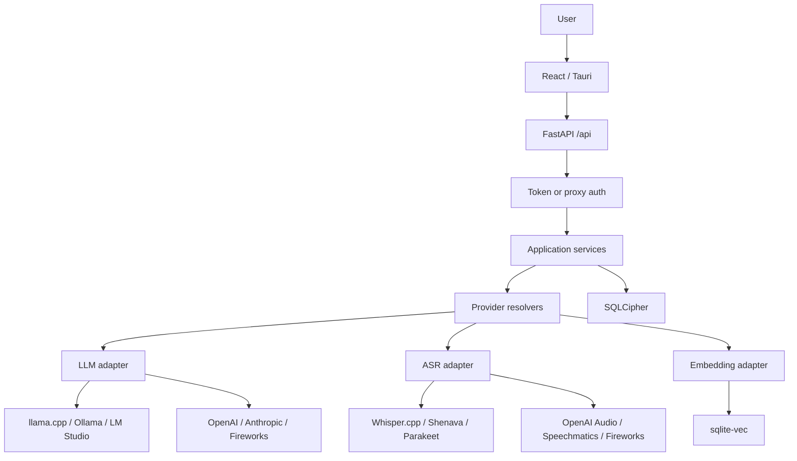

> [!WARNING]
> فلوکس یک پروژه آزمایشی است. پیش از استفاده، بخش **[هشدار استفاده](#هشدار-استفاده)** را با دقت بخوانید.

<p align="center">
  
</p>

<div align="center" dir="rtl">

[](https://github.com/AmiraliGhamkhar/phlox_persian/actions/workflows/ci.yml)
[](https://coveralls.io/github/AmiraliGhamkhar/phlox_persian?branch=main)
[](https://github.com/AmiraliGhamkhar/phlox_persian/actions/workflows/github-code-scanning/codeql)
[](https://github.com/astral-sh/ruff)
[](https://opensource.org/licenses/MIT)
[](https://phlox.bloodworks.io/docs)

</div>

# فلوکس؛ دستیار مستندسازی بالینی فارسی

فلوکس یک دستیار رایگان و متن‌باز برای مستندسازی بالینی است که مدیریت پرونده بیمار و قابلیت‌های هوش مصنوعی عامل‌محور را در خود دارد. این برنامه با رویکرد «محلی در اولویت» طراحی شده و روی سخت‌افزار خودتان اجرا می‌شود. رابط کاربری، متن‌های راهنما و چیدمان برنامه برای فارسی و راست‌به‌چپ آماده شده‌اند.

## قابلیت‌های اصلی

- **🔒 خصوصی و محلی:** داده‌های بیمار در حالت محلی روی دستگاه شما می‌مانند و برای پردازش به سرویس شخص ثالث ارسال نمی‌شوند.
- **🎤 تولید یادداشت محیطی:** از صدای ویزیت، یادداشت بالینی ساختاریافته با قالب قابل تنظیم تولید کنید.
- **💡 بهبود تطبیقی:** خروجی‌ها با استفاده بیشتر و نمونه‌های قبلی شما بهتر با سبک مورد نظر هماهنگ می‌شوند.
- **📝 سیستم قالب منعطف:** از یادداشت نمونه، قالب مستندسازی تولید یا قالب‌ها را دستی ویرایش کنید.
- **🤖 دستیار هوشمند:** با استفاده از منابع علمی و پایگاه دانش محلی به پرسش‌های شما پاسخ می‌دهد.
- **🛡️ تأیید انسانی برای اقدامات ثبت‌داده:** هر ابزاری که در پرونده می‌نویسد (ثبت یادداشت، تکمیل کار، تکمیل فرم PDF) پیش از اجرا کارت تأیید در چت نشان می‌دهد و فقط با تأیید صریح شما اجرا یا لغو می‌شود.
- **🔌 پشتیبانی از سرورهای MCP:** برای افزودن ابزارهای مورد اعتماد، سرورهای ابزار خارجی را متصل کنید؛ هر ابزار سرور را می‌توانید جداگانه فعال یا غیرفعال کنید.
- **✅ مدیریت کارها:** برنامه بالینی را به فهرست کارهای قابل پیگیری تبدیل کنید.
- **✉️ تولید مکاتبه:** بر اساس یادداشت بالینی، نامه بیمار را با یک کلیک تولید کنید.
- **📄 پردازش سند:** فرم‌ها را تکمیل کنید و اطلاعات را با مدل‌های تصویری محلی استخراج کنید.
- **🌐 انتخاب ساده مدل و سرویس:** ارائه‌دهنده، مدل، زبان و حالت محلی/برخط را جداگانه انتخاب کنید. بردارسازی از مدل گفتگو مستقل است.

<p align="center">
  
</p>

## شروع کار

### برنامه دسکتاپ

نسخه‌های آماده برای Apple Silicon در macOS و Flatpak برای Linux با پشتیبانی Vulkan از [صفحه انتشارهای GitHub](https://github.com/AmiraliGhamkhar/phlox_persian/releases) در دسترس هستند.

برنامه دسکتاپ موتورهای `llama.cpp` و `whisper.cpp` را همراه دارد. مدل‌ها را از داخل برنامه دانلود و فعال کنید. برای ASR محلی، سه نسخه از Whisper large-v3-turbo در دسترس است:

1. نسخه دقیق `F16`
2. نسخه کم‌حجم `Q5_0` (پیشنهاد پیش‌فرض)
3. نسخه `Q8_0` با دقت بالاتر و مصرف حافظه متوسط

همچنین مدل فارسی `Shenava-Koochik-v1.0-tract-streaming` با نسخه کم‌حجم `INT4` ارائه می‌شود. مدل‌های Whisper برای فارسی و گفتار فارسی/انگلیسی ترکیبی مناسب‌اند و Shenava برای پیاده‌سازی محلی فارسی بهینه شده است.

### ASR محلی و برخط

در بخش **تنظیمات ← مدل ← ASR** یا هنگام راه‌اندازی اولیه، یکی از گزینه‌های زیر را انتخاب کنید:

- **مدل محلی:** Whisper.cpp برای فارسی و گفتار ترکیبی، یا Shenava برای فارسی.
- **سرویس سازگار با OpenAI:** نشانی پایه، شناسه مدل و در صورت نیاز کلید API را وارد کنید.
- **Speechmatics Realtime:** کلید API را در تنظیمات رمزگذاری‌شده برنامه وارد کنید؛ زبان `auto` برای تشخیص گفتار ترکیبی قابل انتخاب است.

زبان‌های `فارسی`، `انگلیسی` و `تشخیص خودکار؛ فارسی و انگلیسی ترکیبی` پشتیبانی می‌شوند. کلیدهای API هرگز در کد یا مخزن ذخیره نمی‌شوند و پاسخ تنظیمات، کلید ذخیره‌شده را به‌صورت پوشانده نمایش می‌دهد.

### Docker و Podman

تصاویر آماده از [GitHub Container Registry](https://github.com/AmiraliGhamkhar/phlox_persian/pkgs/container/phlox_persian) در دسترس هستند:

```bash
docker pull ghcr.io/amiralighamkhar/phlox_persian:latest
```

توصیه می‌شود از `docker-compose.yml` این مخزن استفاده کنید؛ یک ظرف هم API و هم رابط کاربری ساخته‌شده را روی پورت `5000` ارائه می‌کند:

```bash
cp .env.example .env          # سپس DB_ENCRYPTION_KEY را در .env وارد کنید
docker compose up -d --build  # ساخت تصویر از همین مخزن
docker compose ps             # وضعیت باید healthy شود
docker compose logs -f
```

نکات مهم:

- `DB_ENCRYPTION_KEY` الزامی است و بعد از ساخت پایگاه داده نباید عوض شود (بدون کلید درست، داده رمزگشایی نمی‌شود). برای ساخت کلید: `openssl rand -hex 32`.
- پایگاه داده، بردارها، نسخه‌های پشتیبان و گزارش‌ها همه داخل `/usr/src/app/data` قرار می‌گیرند، بنابراین یک volume برای همین مسیر کافی است.
- `docker-compose.yml` به‌طور پیش‌فرض از named volume (`phlox_data`) استفاده می‌کند، چون مالکیت و اجازه‌های آن از تصویر کپی می‌شود و کاربر بدون امتیاز ظرف (uid/gid 1000) می‌تواند بنویسد. اگر bind mount را ترجیح می‌دهید: `sudo mkdir -p data && sudo chown -R 1000:1000 data`.
- پورت فقط روی `127.0.0.1` منتشر می‌شود. برای دسترسی از بیرون، reverse proxy دارای احراز هویت بگذارید، `ALLOWED_ORIGINS` و در صورت نیاز `ALLOWED_HOSTS` را روی نشانی واقعی تنظیم کنید و `PROXY_AUTH_ENABLED=true` را فعال کنید. در این حالت `HEALTHCHECK` پاسخ‌های `401/403` را نیز سالم می‌شمارد.
- تنظیمات امنیتی شبکه: `ALLOWED_ORIGINS` به‌طور پیش‌فرض خالی است (فقط same-origin)، `ALLOWED_HOSTS` فهرست Hostهای مجاز برای مقابله با DNS rebinding است و `TRUSTED_PROXY_CIDRS` تعیین می‌کند کدام پروکسی‌ها مجاز به ارسال `X-Forwarded-For` هستند (پیش‌فرض: بازه‌های شبکه Docker و loopback).
- با Podman نیز همین فایل‌ها کار می‌کنند (`podman compose`). به‌جای متغیر محیطی می‌توانید کلید را به‌صورت secret در `/run/secrets/db_encryption_key` قرار دهید؛ سرور آن را به‌طور خودکار می‌خواند.
- برای توسعه با hot reload: `docker compose -f docker-compose.dev.yml up` (رابط کاربری روی پورت `3000`، API روی پورت `5000`).

در Docker موتورهای استنتاج محلی دسکتاپ قرار ندارند. برای تشخیص گفتار، یک نقطه پایانی سازگار با OpenAI یا Speechmatics Realtime تنظیم کنید؛ مدل‌های Whisper و Shenava مخصوص نسخه دسکتاپ هستند.

### توسعه

برای نصب وابستگی‌های رابط کاربری و اجرای آن:

```bash
npm ci
npm run dev
```

برای اجرای آزمون‌ها و بررسی کیفیت:

```bash
npm run typecheck
npm run lint
npm test -- --run
cd server && uv run ruff check . && uv run ruff format --check .
cd server && DB_ENCRYPTION_KEY='یک-کلید-آزمایشی-محلی' uv run pytest -q
```

برای ساخت نسخه دسکتاپ، پیش‌نیازهای Tauri، Rust، CMake و ابزارهای توسعه سیستم‌عامل را نصب کنید و سپس `npm run tauri-build` را اجرا کنید.

## معماری

فلوکس متن پیاده‌سازی‌شده را بر اساس فیلدهای قالب به قطعه‌های هدفمند تقسیم می‌کند و خروجی مدل زبانی را به JSON ساختاریافته محدود می‌سازد. سپس یک مرحله بهبود، سبک خروجی را با نمونه مورد نظر شما هماهنگ می‌کند و چرخه بهبود تطبیقی از یادداشت‌های قبلی برای شخصی‌سازی بیشتر استفاده می‌کند.

رابط کاربری هرگز مستقیم با ارائه‌دهنده هوش مصنوعی صحبت نمی‌کند. مسیر درخواست:

```text
Frontend (React / Tauri)
  → FastAPI (/api/*) + auth / validation / audit
  → domain services (chat, transcription, letters, RAG)
  → get_llm_client / resolve_asr_connection / resolve_embedding_connection
  → provider adapter (OpenAI-compatible, Anthropic Messages, STT, embeddings)
  → SQLCipher + sqlite-vec
```



ارائه‌دهندگان از تنظیمات رمزگذاری‌شده عوض می‌شوند، نه با بازنویسی منطق کسب‌وکار. بردارسازی از مدل گفتگو جدا است؛ اگر LLM روی Anthropic باشد، embeddings به‌طور پیش‌فرض به Ollama محلی می‌رود مگر اینکه `EMBEDDING_PROVIDER` جداگانه تنظیم شود. خطاهای گذرا (۴۲۹، ۵xx، شبکه، وقفه) حداکثر دو بار با backoff تکرار می‌شوند؛ خطاهای ۴xx دیگر تکرار نمی‌شوند و failover خودکار به ابر وجود ندارد.

### پشته فنی

- **رابط کاربری:** React و [Chakra UI](https://github.com/chakra-ui/chakra-ui)
- **سرور:** [FastAPI](https://github.com/fastapi/fastapi) و Python
- **پایگاه داده:** [SQLCipher](https://github.com/sqlcipher/sqlcipher)
- **پایگاه برداری:** [sqlite-vec](https://github.com/asg017/sqlite-vec)
- **پوسته دسکتاپ:** [Tauri](https://github.com/tauri-apps/tauri)
- **مدل زبانی:** سرور [llama.cpp](https://github.com/ggml-org/llama.cpp)، Ollama، LM Studio، 9Router/OmniRoute، OpenAI-compatible، OpenAI، Anthropic Messages، Fireworks
- **ASR:** Whisper.cpp محلی، Shenava، Parakeet (غیر فارسی)، سرور Whisper.cpp، OpenAI Audio، Speechmatics Realtime، Fireworks live/batch
- **بردارسازی:** نقطه پایانی مستقل `/v1/embeddings` (Ollama، LM Studio، llama.cpp، OpenAI، Fireworks، دروازه‌ها)

## لایه‌های امنیتی و حریم خصوصی

- **محلی در اولویت:** پردازش روی دستگاه شما انجام می‌شود و پایگاه داده با [SQLCipher](https://github.com/sqlcipher/sqlcipher) رمزنگاری می‌شود؛ کلیدهای API هرگز در کد یا مخزن ذخیره نمی‌شوند و در پاسخ تنظیمات پوشانده نمایش داده می‌شوند.
- **پاک‌سازی PHI در جست‌وجوی بیرونی:** پرس‌وجوهای ارسالی به PubMed، ویکی‌پدیا و ابزارهای MCP پیش از خروج، از شناسه‌های بیمار فعال (نام، شماره پرونده، کد ملی، تاریخ میلادی/جلالی با ارقام فارسی و ایمیل) پاک‌سازی می‌شوند و نشانی‌های اینترنتی ورودی کاربر با محافظ SSRF بررسی می‌شوند.
- **تأیید انسانی برای ابزارهای ثبت‌داده:** ابزارهای نویسندهٔ پرونده هرگز مستقیم اجرا نمی‌شوند؛ ابتدا در صف اقدام در انتظار تأیید قرار می‌گیرند و فقط از مسیر «تأیید» در رابط کاربری اجرا می‌شوند (یا منقضی/لغو می‌شوند).
- **سخت‌سازی درخواست‌ها:** CORS به‌طور پیش‌فرض فقط same-origin است، فهرست Host مجاز در برابر DNS rebinding می‌ایستد، هدر `X-Forwarded-For` فقط برای CIDRهای پروکسی معتمد پذیرفته می‌شود، نرخ درخواست‌ها با الگوریتم توکن-سطل محدود می‌شود، حجم بارگذاری تصویر/صدا سقف دارد و همه درخواست‌های API در گزارش ممیزی ثبت می‌شوند.
- **بررسی پیوسته:** در CI، تحلیل استاتیک CodeQL برای JS/TS و Python به همراه `npm audit`، `pip-audit` و `cargo audit` اجرا می‌شود و `ruff` مرز سبک کد را نگه می‌دارد.

## هشدار استفاده

فلوکس یک پروژه آزمایشی برای استفاده آموزشی و شخصی است. **این برنامه وسیله پزشکی تأییدشده نیست، نباید برای تصمیم‌گیری بالینی استفاده شود و در وضعیت فعلی برای استقرار تولیدی مناسب نیست.** اگر قصد استفاده بالینی دارید، مسئولیت رعایت قوانین و الزامات محلی مانند HIPAA، GDPR و سایر مقررات بر عهده شماست.

خروجی هوش مصنوعی ممکن است نادرست باشد. همیشه محتوای تولیدشده را بررسی کنید و برای همه تصمیم‌های بالینی به قضاوت حرفه‌ای و راهنماهای معتبر تکیه کنید. برنامه هنگام شروع، هشدار کامل را نمایش می‌دهد.

## مجوز

[مجوز MIT](LICENSE)

برای اطلاعات مدل‌ها و وابستگی‌های شخص ثالث، [صفحه اعتبارها](https://phlox.bloodworks.io/docs/credits) را ببینید.

## مشارکت

[راهنمای مشارکت](.github/CONTRIBUTING.md)

این مخزن با کمک ابزارهای توسعه هوش مصنوعی ساخته شده است. همه مشارکت‌کنندگان باید پیش از ارسال تغییرات، کد تولیدشده و اثر آن بر حریم خصوصی و ایمنی داده‌های بالینی را بررسی کنند.
